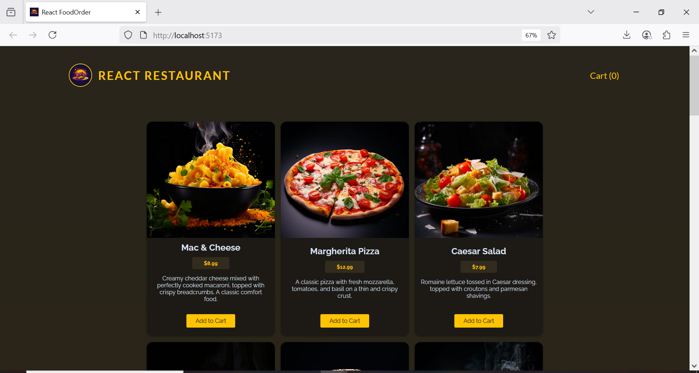
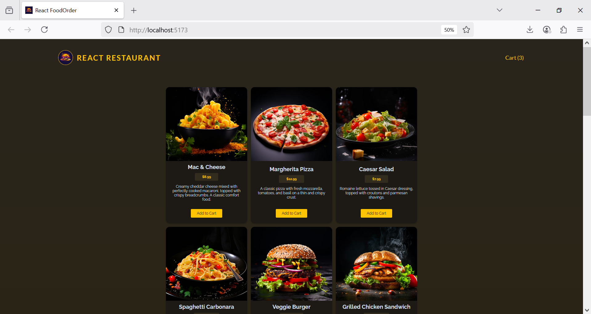
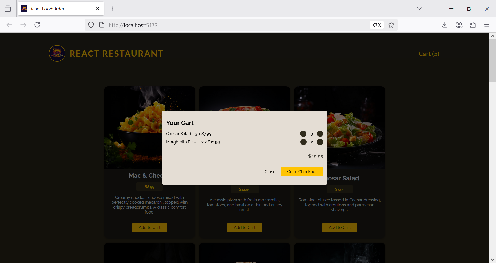
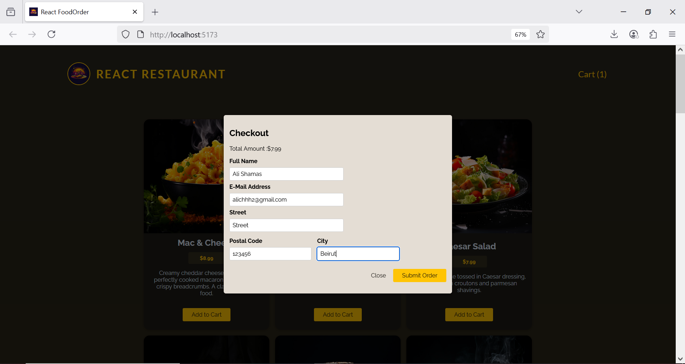
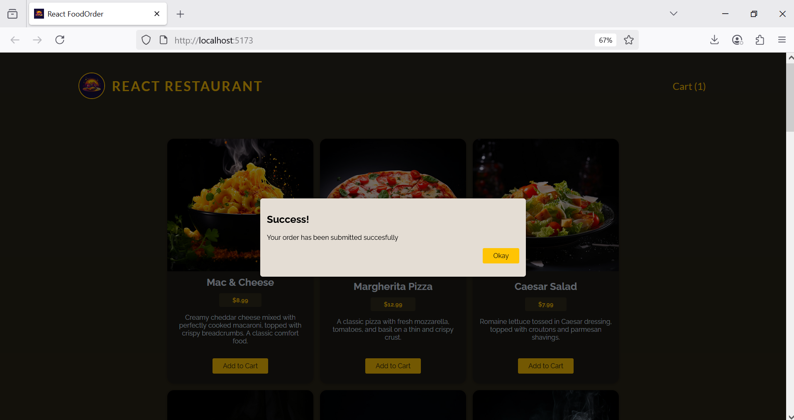

# 🍽️ React Food Order App


## 📸 Screenshots

# 🥘 Meals Page




# 🛒 Cart Modal


# 🧾 Checkout Form





This is a simple and responsive food ordering app built with React. It fetches meal data from a backend, allows users to add/remove meals to/from a cart,
and place orders via a checkout modal.

---

## 🚀 Features

- View meals loaded from a backend API
- Add meals to the cart with quantity control
- Remove items from the cart
- Smooth modal-based cart and checkout UI
- Send order data to a backend (via POST request)
- UI feedback for loading, success, and error states

---

## 🛠️ Tech Stack

- **Frontend**: React (with Context API)
- **Backend**: Node.js / Express (simulated via `localhost:3000`)
- **State Management**: Context API + custom hooks (`useHttp`)
- **Styling**: CSS (or Tailwind, if used)
- **Form Handling**: Native HTML form with FormData API

---## ⚙️ How to Run

1. **Clone the repository:**

   ```bash
   git clone https://github.com/your-username/food-order-app.git
   cd food-order-app

    Install dependencies:

2 .npm install

3 .Start the React app:
   npm start
4. Start your backend :
   node backend/app.js

